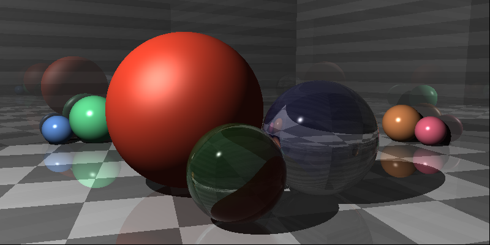

# Glimpse



Glimpse is a ray tracer written in Go. It is an implementation of the [Ray tracer challenge](https://pragprog.com/titles/jbtracer/the-ray-tracer-challenge/) by Jamis Buck.

## Features

It can render primitives such as 
- spheres 
- planes 
- cubes
- cylinders. 

It can render shadows, reflections, and refractions. It can render a scene with multiple light sources.

## Installation


## Usage

glimpse accepts a yml file as input. The yml file contains the scene description. The scene description contains the camera, lights, and objects in the scene. 

```
glimpse example.yml
```

The format is the following:

```
# describe the camera
camera:
  width: 800                    # width of the image
  height: 400                   # height of the image
  fov: 0.785                    # field of view in radians
  from: [8, 6, -8]              # camera position, x,y,z coordinates
  to: [0, 3, 0]                 # camera target (where it is looking at)
  up: [0, 1, 0]                 # camera up vector

# describe the light source
light:
  position: [0, 6.9, -5]        # light position, x,y,z coordinates
  intensity: [1, 1, 0.9]        # light intensity, r,g,b values between 0 and 1

# describe the objects in the scene
objects:
  - type: sphere                # type of object
    # By default the object is rendered in the center of the scene.
    # You can transform the object by applying a series of transformations.
    transform:  
      - type: "translate"       # translates the object in the 3d space
        values: [0, 1, 0]
      - type: "scale"           # scales the object in the 3d space
        values: [20, 7, 20]
```

You can see complete scenes in the [examples](examples) directory.

